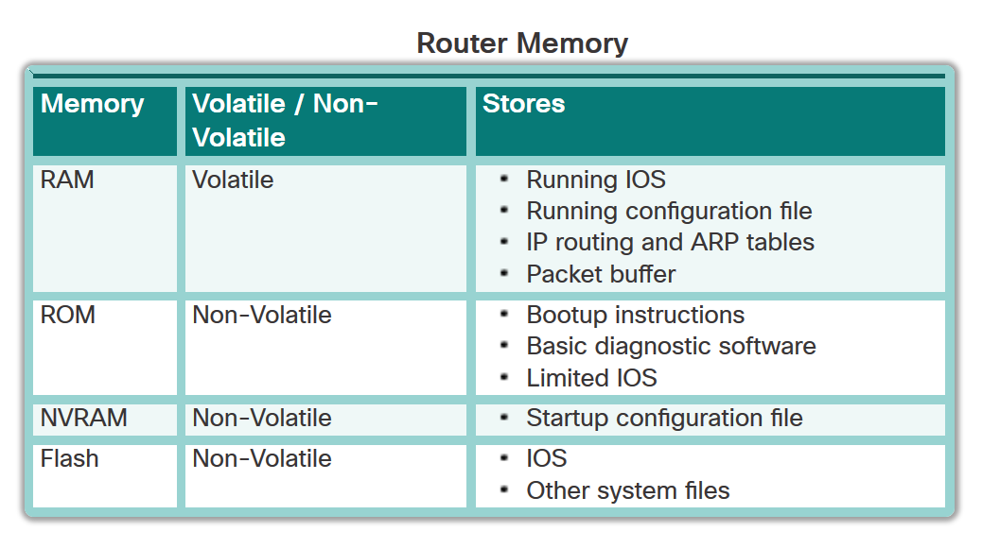

# Router features
## Transmission strategie :
Pre-calculate route for designed destination using routing table
- process switching
- Fast switching
- Cisco Express Fowarding (CEF)

Management Lenght -> Fiabilité
Metrique (time ...) -> Intéréssante  
