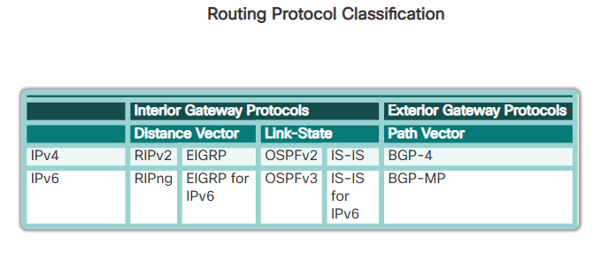

# CCNA2 - Chapter 7 - Dynamic routing
- Administrative distance used to evaluate route fiability from differents routing sources
- Route Metric used to compared 2 route from the same protocol

## Routing Dynamics Protocols
Two families :
- IGP Protocol : Intern of autonomous system :
  - Distance VEctor :
    - RIPv2 + RIPng
    - EIGRP + EIGRP for IPv6 (DUAL)
  - Link state :
    - OSPFv2 + OSPFv3 (Dijkstra)
    - IS-IS + IS-IS for IPv6
- EGP Protocol : Extern of autonomous system
  - Path state : BGP-4 + BGP-MP


### Behaviors
#### Functions :
- Shared routes and links
- Detect distance networks
- Refresh routing datas
- Chose best path (with metrics)
- Chose backup routes (depending on convergence time)

Composed of :
- Data structures (table or data bases)
- Routing Protocol Messages
- Algorithme

#### Roles :
- Pro :
  - Auto share datas
  - ID the best path + Add to route table
  - Less administrative tasks than static routing
  - For network admin, easily manageable
- Cons :
  - Use hardware ressources (bandwidth+CPU)

### Static vs Dynamics
- Network combine dynamics and statics routing
- Statics Routing used cause :
  - Easy maintainable
  - route from/to ISP (Internet Service Provider) and default routes

Static Routing :
- Pro :
  - Easy to implement in small network
  - Safe ( no announcement on network)
  - No hardware ressources used
- Cons :
  - Complexity for big network
  - Admin need to interact to change routes

Dynamic Routing :
- Pro :
  - Appropriate for all topologys with multiples routers
  - Independant of network size
  - Auto Adapte to topology to foward network trafic if possible
- Cons :
  - Less save : share routes data on networks
  - Routes depends on actual topology
  - Need best hardware (CPU, bandwidth ...)

### Routing Protocols behaviors
Dynamics route behavior :
- routers send and receive routing messages on Interfaces
- router share routing messages with others routers using same protocols
- Routers exchange routing datas to discovered distanced networks
- When router detect a topology change, the routing protocol can annouce it to others routers

Split horizon : To avoid loop router -> don't send on interfaces routes teached from this interface.

To convergent :
- Convergent when all routers know datas of the Network
- Convergence time is the needed time to share datas, calculate best paths and update route table

Routing with class :
Not include subnet-mask
- Sending :
  - If the route and output interface not in same network -> announce network per class.
  -  If the route and output interface in same network && same subnet mask -> announce the route
- Receiving :
  - If the received route in same network of input interface -> adding route with input interface subnet mask
  - If the received route not in same network of input interface -> adding the route with the mask of the classe

Routing without class :
- Include subnet-mask in routing updates
- RIPv3, EIGRP, OSPF and IS_IS
- Compatible with VLSM and CIDR
- IPv6 ready

## Distance-vector Routing
- Using Belmanfort algorithme
- Share updates between neighbor
- Don't know the network topology
- Updates consume bandwidth
- Using now multicast (routers ar subscribed to multicast address)

## RIP & RIPng
RIP is encapsulate by UDP
### RIPv1 :
```
router rip
network <class_net_address>
```

- `show ip protocols` : Display enabled routing protocols

### RIPv2 :
```
router rip
version 2
no auto summary
network <class_net_address>
```

Sending useless route update on a LAN can :
- Use bandwidth
- Use ressources
- cause Security problems

- `passive interface` : Disable routing protocol on interface
- `default-information-orginate` : include default static route in routing update protocol

### RIPng (IPv6)
```
ipv6 unicast-routing

interface gigabiteethernet 0/0
ipv6 rip RIP-AS enable
no shutdown

interface serial 0/0/0
ipv6 rip RIP-AS enable
no shutdown
```

## Link-state Routing
Using Dijkstra algorithme :
All routers know network topology.

Store in RAM and topology base and routing table (after algorithme process -find best path).
Can send route or link (LSP Link-State Packet)
Link=interface

Steps :
- Say "Hello" on directly connected interfaces -> know next hop ip
- Create LSP (with weight)
- Flood LSP
- Create data base of Link-states
- Create SPF (shortest-path-first known as Dijkstra) topology (know intermediate router and execute best path algorithme)
- Install route in routing table

Disadvantage :
- Need memory
- Process time
- Bandwidth
- ==> Create area to use less routers ressources

Link-state used by :
- OSPF (Open Shortest Path First) :
  - OSPFv2 (and OSPFv1) : IPv4
  - OSPFv3 : IPv6
- IS-IS

## Routing table
How to parse table to get best match

Terms :
- Ultimate route (best match) : contains next hop or output interface(link local, directly connect ...)
- Level 1 route : Route having subnet mask <= class mask ==> (Network, Super network, default)
- Parent route level 1 : Network subnetted ==> no next hop ip or ouput interface
- Child route level 2 : Route of subnet (of parent route level 1)

Seek best match step by step :
- Seek best route in Level 1 routes NETWORK
  - If found use it
-  Seek best Level 1 parents
  - Seek best route in Level 2 children
    - If found use it
    - Without ip classless -> surrend (`no ip classless`)
- Seek best route in Level 1 routes SUPER NETWORK
- Use default route

Best route = longest match (between bits)

## Resume


