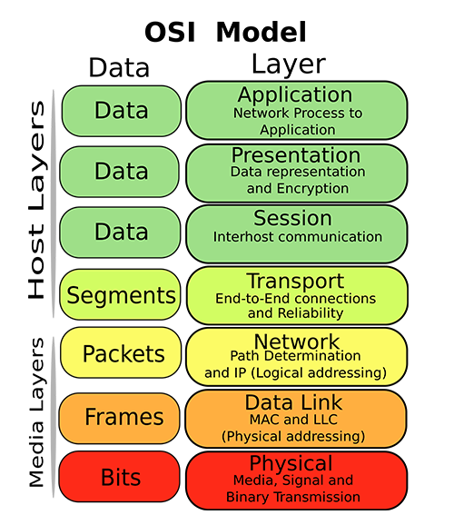

# Cheatography
## OS
### Commons
- `ipconfig` command
	- display all IP configuration :
	- `ipconfig <IP@> <subnet-mask@>` : set the IP @ and the subnet mask @
- `arp` command :
	- `arp -a` : display all ARP entries
	- `arp -d` : Clear the ARP table

### IOS
Access Méthods :
- Console (don't need network configuration)
- Telnet
- SSH

#### Commons
- Prompts :
	- `>` : standard mode
	- `#` : root (voir diff croisillon vs diese)
	- `#(config)` : config mode
	- `#(config-if)` : config interface mode
	- `#(config-line)` : config interface mode
- `[<cmd>]?` : global help or command help
- `exit` | `logout`  :  Exit from the EXEC

#### Normal Mode
- Prompt : `>`
- `traceroute <IP @>` : connaitre les routers entre deux hotes (>ping)

#### Enable Mode (SU)
- Prompt : `#`
- `enable` : enter admin mode ( more command )
- `disable` : exit admin mode
- `configure <stuff>` : enter configuration mode on stuff
- `show <info_type>` : show informations
	- Memory :
		- `show startup-config` : show startup config
		- `show running-config` : show running config
		- `show flash` : show flash config
	- `show mac-address-table` : show MAC @ table
	- `show arp` : show ARP cache (or ARP table)
	- `show ip <tag>` : show ip informations :
		- `show ip route` : show ip route
		- `show ip interface brief` : show IP status and configuration briefing of all interfaces
	- `show interfaces` : Show interfaces briefing :
		- `show interfaces <interface_type> <interface#>` : show  interface brief
		Exemple #1 : `show interfaces GigabitEthernet 0/0` show GigabitEthernet 0/0 informations
		Exemple #2 : `show interfaces Serial 0/0/0` show serial 0/0/0 informations
- `copy <src> <dest>` : copy storage to an other storage
	- `copy running-config startup-config` : save running config
	- `copy startup-config running-config` : undo running config modification

#### Configuration  Mode
- Prompt : `#(config)`
- `hostname <name>` : rename switch
- `configure terminal` : enter configuration mode on terminal
- `[no] enable password <password>` : toggle config password (default non-crypted)
- `[no] enable secret <secret>` : toggle secret (crypted secret)
- `[no] service password-encryption` : toggle password encryption
- `router` : change route protocol
- `banner <mode> <msg>` :config banner
	- `banner motd <mymotd>` : config the "Message Of The Day" (to advert specified unauthorized people)
	- `banner login <msg>` : config the login message
- Enter in other configuration mode :
	- `line <line_type> <line#>` : Enter config mode on terminal type for line # X
	- `end` : exit config mode
	- `interface <interface_type> <0-9>` : Enter config interface mode for # X

##### Configuration line Mode
- Prompt: `#(config-line)`
- `line <line_type> <line#>` : enter config mode on terminal type for line # X
	Exemple : `line console 0` : configure console line # 0
- `[no] password <password>` : toggle a password
- `login` : enable password checking

##### Configuration Interfaces Mode
- Prompt : `#hostname(config-if)`
- `interface <interface_type> <interface#>` : Enter config interface mode on interface type for # X :
	Exemple : `interface vlan <vlan#>` : Enter configuration mode for Vlan number #
- `[no] shutdown` : toggle interface
- `ip` : config ip :
	- `ip address <@IP> <mask>` : change ip
- `description <desc>` : set description to the interface
---
## OSI Model

### Protocols Resume
- Host layers
	- Application Layer (PDU : Data) :
		- DNS : Domaine Name System
		- FTP : File Transfert Protocol
		- SSH : Secure Shell
		- SMTP :
		- TLS/SSL
		- XMPP
		- HTTP
		- RIP : Routing Information Protocol
	- Transport Layer (PDU : Segment/Datagram) :
		- TCP : Transport Communication Protocol
		- UDP : User Datagram Protocol
- Media layers :
	- Network Layer (PDU : Packet) :
		- AppleTalk :
		- EIGRP : Enhanced Interior Gateway Routing Protocol
		- IP (IPv4/IPv6): Internet Protocol (type 0800)
		- ICMP : Internet Control Message Protocol (ping)
		- IGMP : Internet Group Management Protocol
		- OSPF : Open Shortest Path First
	- Data Link Layer (PDU : Frame) :
		- ARP : Address Resolution Procotol (type 0806)
		- Ethernet 802.3
		- MAC (sublayer): Media Access Control
		- LLC (sublayer) : Logical Link Control
			- CSMA/CA : Carrier-Sense Multiple Access with Collision Avoidance
			- CSMA/CD : Carrier-Sense Multiple Access with Collision Detection
		- HDLC :
		- STP : Spanning Tree Protocol
			Running on bridges and switches
			ensure that there is no loops (cause by redundant paths)
		- PPP : Point to Point Protocol
		 Used to establish a direct connection between two nodes
		- Frame Relay
		- ATM (Asynchronous Transfer Mode)
	- Physical Layer (PDU : Bit):
		- Wifi 802.11
		- Bluetooth 802.15.1
		- DSL : Digital Subscriber Line

### ARP (Address Resolution Protocol)
- Device level 3 :
	- "ARP Table" presents on devices Also called "ARP Cache"
	- Associates IP @ with MAC @
- Device level 2 :
	- "Mac address Table"
	- Associates  MAC @ with PORT #
- Gratuitous ARP Request :
	- MAC dest @ = "ff:ff:ff:ff:ff:ff"  (broadcast MAC)
	- IP Source and destination @ are the same (IP src @ = IP dest @)
	- No reply will occure
	- Update MAC @ in ARP table if IP is recognized otherwise it's dropped

#### Exemple :  A -> B (A know B's IP)
All datas are cleared (no mac @ table, no ARP cache)
1. `A` prepare to send data to `B`
	1.  A check if B is on his network
		- logical & between the IP @ of `B` and the IP Mask @ of `A`
		- logical & between the IP @ of `A` and the IP Mask @ of `A`
		- If equals -> same network otherwise other network (here equals)
	2. `A` look for the MAC@ of `B`
		- check if the IP@ of `B` is present in the ARP cache
		- if present A know MAC@ of `B` with the IP@ of `B`

### IP
### NAT/PAT
---
## Physical
### Topology Diagrams :
- Physical :
Identify the physical location of intermediary devices and cable installation.
- Logical :
 Identify devices, ports, and addressing scheme.

### Connections
Auto MDI-X :automatically detects the required cable connection type and configures the connection appropriately

- Connections :
	- Console
	- Copper Ethernet Wires :
			UTP : Unshielded Twisted Pair
			STP/FTP : Shielded Twisted / Foiled Twisted Pair
			SFTP : Shielded and Foiled Twisted Pair
		- Copper Straight-Through Wired Cables
		- Copper Crossover Wired Cables
		- Copper Rollover Wired Cables : Perfect symetrie
	- Fiber
	- Phone
	- Coaxial
	- USB

- Duplex Mode :
	- Full-duplex
	- Half-duplex
	- Auto

- Interfaces :
	- Serial
	- GigabitEthernet
	- FastEthernet

### Network Devices
It is all node devices

- End Devices :
	- IP Phone
	- Laptop
	- PC
	- Printer
	- Phone
	- Server
	- Smartphone
	- Sniffer
	- TV
- Routers
- Switches
- Hubs
- Wireless Devices
	- Access Point
	- Cell Tower
- Security :
	- Firewall
- WAN Emulator :
	- DSL Modem
	- Cable Modem

---
## Organisations :
- IEEE : Institute of Electrical and Electronics Engineers
- ISP : internet Service Provider
