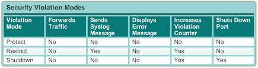
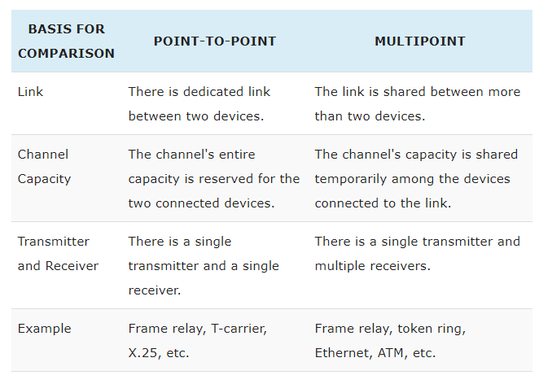

# Cheatography - CCNA2

## Layer 2
- Configure SVI : `interface vlan <vlan#>`

### Security
- Enable port security : `[no] switchport port-security`
- Set secured mac address : `switchport port-security mac-address <H.H.H.H|sticky>`
- Set maximum mac address on the port : `switchport port-security maximum <# of authorized devices>`
- Set violation rule : `switchport port-security violation <protect|restrict|shutdown>`



### VLAN
- Set switchport mode : `switchport mode {trunk|access|dynamic}`
- Set the native vlan: `switchport native vlan <vlanId>`
- Set access mode on vlan : `[] switchport access vlan <vlanId>`
- Set allowed vlan to trunk port : `[no] switchport trunk allowed vlan <#>,<#>,<#>,<#>-<#>,<#>-<#>,<#>-<#>,<#>-<#>`
- Add allowed vlan to trunk port : `switchport trunk allowed vlan add <vlanId>`
- Disable negotiation protocol : `switchport nonegotiate`

|  |  Dynamic Auto   | Dynamic Desirable |  Trunk | Access |
| :------------- | :------------- |
| Dynamic Auto | Access| Trunk | Trunk | Access |
| Dynamic Desirable | Trunk | Trunk | Trunk | Access |
| Trunk | Trunk | Trunk | Trunk | Limited Connectivity |
| Access | Access | Access | Limited Connectivity | Access |

- Set the dynamic mode `switchport mode dynamic {auto|desirable}`


Database manager of switch : "SDM (Switch Database Manager)"

### Inter-VLAN Router on stick
- Show type of switchport `show interfaces <interface> switchport`
- Set encapsulation for vlan on sub-interface : `encapsulation <protocol> <vlanId> [native]`
- Disable switchport and enable routed port : `no switchport`

## Layer 3
- Config ipv6 link local : `ipv6 address <@ipv6> link-local`
- Administrative Distance : Level of trust
- Metric : Determine best path


**Default metrics :**
// TODO

**Default Administrative Distance :**

| Route Source     | Default Distance Metric    |
| :------------- | :------------- |
| Connected interface	  | 0       |
| Static route	| 1 |
| Enhanced Interior Gateway Routing Protocol (EIGRP) summary route | 5 |
| External Border Gateway Protocol (BGP) | 20 |
| Internal EIGRP | 90 |
| IGRP	| 100 |
| OSPF | 110 |
| Intermediate System-to-Intermediate System (IS-IS) | 115 |
|  Routing Information Protocol (RIP)	| 120 |
| Exterior Gateway Protocol (EGP)	| 140 |
| On Demand Routing (ODR)	| 160 |
| External EIGRP	| 170 |
| Internal BGP	| 200 |
| Unknown*	| 255 |

**Routing table Codes :**

 | Code | Description     |
 | :------------- | :------------- |
 | C       | Connected       |
 | S      | Static       |
 | I     | IGRP       |
 | R      | RIP       |
 | M     | Mobile       |
 | B     | BGP       |
 | D | EIGRP |
 | EX    | EIGRP external  |
 | O | OSPF |
 | IA | OSPF Inter Area|
 | N1 | OSPF NSSA external type 1 |
 | N2 | OSPF NSSA external type 2 |
 | E1 | OSPF external type 1|
 | E2 | OSPF external type 2 |
 | E | EGP |
 | i | IS-IS |
 | L1 | IS-IS level-1 |
 | L2 | IS-IS level-2 |
 | ia | IS-IS inter area |
 | * | candidate default |
 | U | per-user static route |
 | o | ODR |
 | p | periodic downloaded static route |

### Statics Routing
- Config routes
  - Set static route :
    - IPv4 : `[no] ip route <@subnet_ip> <subnet_mask> <exit_interface | next_hop_ip> [exit_interface | next_hop_ip] [metric_distance]`
    - IPv6 : `[no] ipv6 route <@subnet_ipv6/prefix_length> {interface|@next_hop_ipv6} [metric_distance]`
  - Set default gateway :
    - IPv4 : `[no] ip route 0.0.0.0 0.0.0.0 <ip-address|exit-interface> [metric_distance]`
    - IPv6 : `[no] ipv6 route ::/0 <ipv6-address|exit-interface> [metric_distance]`

### Dynamics Routing
Split horizon : To avoid loop router -> don't send on interfaces routes teached from this interface.

Routing with class :
- Sending :
  - If the route and output interface not in same network -> announce network per class.
  -  If the route and output interface in same network && same subnet mask -> announce the route
- Receiving :
  - If the received route in same network of input interface -> adding route with input interface subnet mask
  - If the received route not in same network of input interface -> adding the route with the mask of the classe

- Enable routing protocol and enter in router config mode :
  - IPv4 `[no] router <routing_protocol> <process_id|autonomous-system-number>`
  - IPv6 :
  ```
  [no] ipv6 router <routing_protocol> <process_id|autonomous-system-number>
  [no] shutdown
  ```

- Edit administrative distance on routing protocol : `[no] distance <administrative_distance>`
- `[no] version <#version>` : toggle protocol version
- `[no] auto-summary` : toggle route summary
Adding network to routing flow :
  - IPv4 : `[no] network <net_ip>` :
    - RIP -> `[no] network <class_net_address>` : use class net address
  - IPv6 :
  ```
  interface <interface_id>
  [no] ipv6 <protocol> <processId> [area <#area>]
  ```
- `[no] passive interface <interface>` : Disable routing protocol on interface
- `[no] default-information originate` : include default static route in routing update protocol (destribute default route to others routers)

- `[no] ipv6 rip <name> enable` : Enable RIPng on interface

- `[no] ip classless` : (default behavior) Disable classless (not about routing by class)
- `[no] debug <ip|ipv6> <routing_protocol>` : toggle debug for routing protocol


### ACL - Access List
- `show access-lists` : Show access-lists info and statistics
- `clear access-list counters <ACL_id>` reset counters

- Set ACL on interface :`ip access-group {access-list-number|access-list-name} {in|out}`
- Delete : `no access-list <access-list-number>`
- Add remark : `access-list <access-list-number> remark <remark>`
- Delete ACL line :
  ```
  ip access-list {standard | extended} <ACL_id>
  no <line_number>
  ```
- Insert ACL line :
  ```
  ip access-list {standard|extended} <ACL_id>
  <line_number> ...
  ```
- Set access list on VTY :
    ```
    access-class <access_list_id> {in|out}`
    ```
- IPv4 :
  - Standard :
  ```
  access-list <access-list-number 1-99> {permit|deny} [remark] {host <sender_address> | <sender_address> [sender_wildcard_mask] <sender_address> | any}  
  ```
  - Extended :
  ```
  access-list <access-list-number 100-199> {permit|deny} [remark] <protocol> {host <source_ip> | any | <source_network_ip> <wildcard_mask} [{eq|lt|gt} <source_port>] [dest_port {eq|lt|gt} <dest_port>] [etablished]
  ```
- IPv6 :
```
ipv6 access-list <access-list-name>
{deny|permit|remark} <protocol> {<source-ipv6-prefix/prefix-length> | any | host <source-ipv6-address>} [{eq | gt | ls} <source-port>]
```

### DHCP
- Show :
  - From server :
    - `show ip dhcp binding` : MAC@ <-> IP@
    - `show ip dhcp server statistics` :
    - `show ip dhcp conflict`
  - From Client :
    - `show running-config | section dhcp` :

- `[no] ip dhcp excluded-address <low-address> [<high-address>]` : exclude range of address

-  Relay :`ip helper-address <next-hop-dns-ip-address>` : foward some UDP services -> heure,TACAS, DNS, client BOOTTP/DHCP,  server BOOTTP/DHCP, TFTP, names service NetBios, datagram service NetBios

- `[no] ip address dhcp` : set ip address from dhcp servers

- `[no] ip dhcp pool <pool-name>` : enter dhcp config mode

 Configure DHCP server in DHCP configuration mode :
- `network <ip-address> <ip-mask>` : Set pool of address
- `default-router <gateway-address> [<gateway-address>] [...]` : Set default gateway address
- `dns-server <dns-address>` : set dns server address
- `domain-name <domain-name>`
- `lease <time>` : define leasing time

- `debug ip packet`
- `debug ip dhcp server events`

---

## Misc
### IOS Commands
- Config SSH :
  - Enable SSH v2 `ip ssh version 2`
  - Set time out : `ip ssh authentication-retries <number-of-retries>`
  - Set time out : `ip ssh time-out <seconds>`
- Config interface 3 to 24 : `interface range <link_type> 0/3 - 24`
- Config interface 3 and 24 : `interface range <link_type> 0/3,  <link_type> 0/24`
- Don't limite display : `terminal length 0`
- `traceroute`:Trace route to destination

- Show :
  - `show <misc> | {include <inclusion>| section <section-name>}` : Filter show prompt
  - `show ip protocols` : Display enabled routing protocols
  - `show ip interface` : Displays the IP interface status and configuration
    - `show ip interface brief`: Displays a brief summary of IP status and configuration
- `show ip route` : Displays the full IP routing table
  - `show ip route <type|protocol>` : Displays a list of active route, exemple : `show ip route connected`
- `show interfaces`
  - `show interfaces <interface> switchport` : Show global or interface switchport config
  - `show interfaces trunk` : Show trunk config
- `show running-config` : Displays the current operating configuration
- `show port-security <address|interface>`: Show port security info :
- `show vlan [brief]` : Show VLAN config

- `boot system` : Set BOOT environment

### DOS Commands
- `ipconfig` : The output of the default command contains the IP address, network mask and gateway for all physical and virtual network adapters.
 - `ipconfig /all` : This option displays the same IP addressing information for each adapter as the default option. Additionally, it displays DNS and WINS settings for each adapter.
- `nslookup <name>` : Displays information that you can use to diagnose Domain Name System (DNS) infrastructure.
- `tracert <name|@ip>` - Determines the path taken to a destination by sending Internet Control Message Protocol (ICMP) Echo Request messages to the destination with incrementally increasing Time to Live (TTL) field values. The path displayed is the list of near-side router interfaces of the routers in the path between a source host and a destination. The near-side interface is the interface of the router that is closest to the sending host in the path. Used without parameters, tracert displays help.

## Others
- Line configration :
  - Point to point : PPP (Serial)
  - Multipoint : Ethernet (FastEthernet/GigabitEthernet/...)

  
