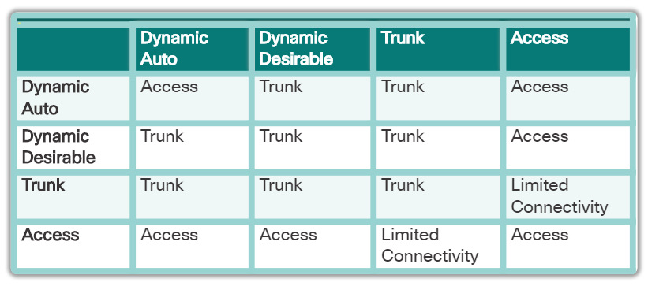
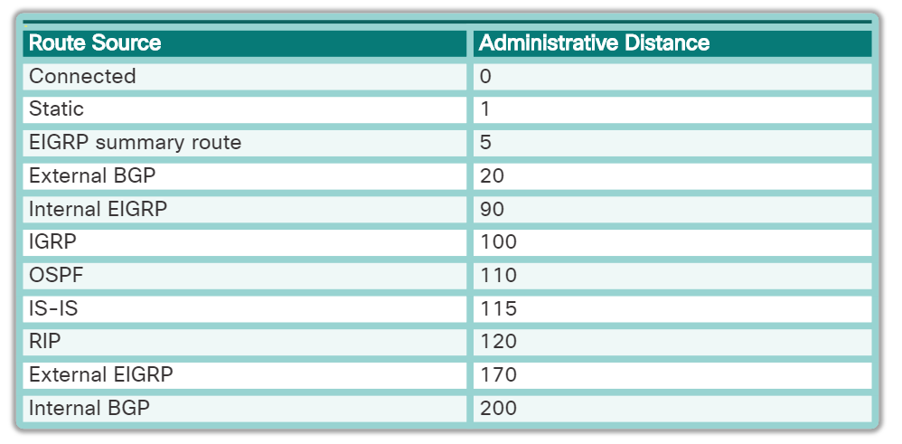
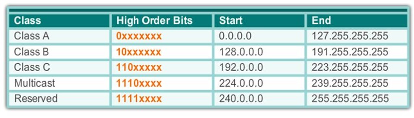

# Cheatography - CCNA2
## Switch
- Configure SVI : `interface vlan <vlan#>`
### Security
- Enable port security : `[no] switchport port-security`
- Set secured mac address : `switchport port-security mac-address <H.H.H.H|sticky>`
- Set maximum mac address on the port : `switchport port-security maximum <# of authorized devices>`
- Set violation rule : `switchport port-security violation <protect|restrict|shutdown>`

### VLAN :
- Set switchport mode : `switchport mode <trunk|access|dynamic>`
- Set the native vlan: `switchport native vlan <vlanId>`
- Set access mode on vlan : `switchport access vlan <vlanId>`
- Add allowed vlan to trunk port : `switchport trunk allowed vlan add <vlanId>`
- Disable negotiation protocol : `switchport nonegotiate`

- Set the dynamic mode `switchport mode dynamic <auto|desirable>`

Database manager of switch : "SDM (Switch Database Manager)"

## Inter-VLAN
- Show type of switchport `show interfaces <interface> switchport`
- Set encapsulation on interface : `encapsulation <protocol> <vlanId>`
- Disable switchport and enable routed port : `no switchport`

## Router
- Config ipv6 link local : `ipv6 address <@ipv6> link-local`
- Administrative Distance : Level of trust

- Metric : Determine best path

### Statics Routing
- Config routes
  - Set static route :
    - ipv4 : `[no] ip route <@subnet_ip> <subnet_mask> <network_ip> {exit_interface|next_hop_ip} [metric_distance]`
    - ipv6 : `[no] ipv6 route <@subnet_ipv6/prefix_length> {interface|@next_hop_ipv6} [metric_distance]`
  - Set default gateway :
    - IPv4 : `[no] ip route 0.0.0.0 0.0.0.0 <ip-address|exit-interface> [metric_distance]`
    - IPv6 : `[no] ipv6 route ::/0 <ipv6-address|exit-interface> [metric_distance]`

### Dynamics Routing
Split horizon : To avoid loop router -> don't send on interfaces routes teached from this interface.

Routing with class :
- Sending :
  - If the route and output interface not in same network -> announce network per class.
  -  If the route and output interface in same network && same subnet mask -> announce the route
- Receiving :
  - If the received route in same network of input interface -> adding route with input interface subnet mask
  - If the received route not in same network of input interface -> adding the route with the mask of the classe

- `router <routing_protocol>` : Enable routing protocol and enter in router config mode
- `[no] distance <administrative_distance>` : Edit administrative distance on routing protocol
- `[no] version <#version>` : toggle protocol version
- `[no] auto-summary` : toggle route summary
- `network <net_ip>` : Adding network to routing flow
- `[no] passive interface <interface>` : Disable routing protocol on interface
- `[no] default-information originate` : include default static route in routing update protocol (desitribute default route to others routers)
- `[no] ipv6 router <routing_protocol> <name>` : Enable IPv6 protocol
- `[no] ipv6 rip <name> enable` : Enable RIPng on interface

- `[no] ip classless` : (default behavior) Disable classless (not about routing by class)
- `[no] debug <ip|ipv6> <routing_protocol>` : toggle debug for routing protocol

## Misc
### IOS Commands
- Enable SSH v2 `ip ssh version 2`
- Config interface 3 to 24 : `interface range FasEthernet 0/3 - 24`
- Don't limite display : `terminal length 0`
- `traceroute`:Trace route to destination
- Show :
  - `show ip protocols` : Display enabled routing protocols
  - `show ip interface` : Displays the IP interface status and configuration
    - `show ip interface brief`: Displays a brief summary of IP status and configuration
  - `show ip route` : Displays the full IP routing table
    - `show ip route <type|protocol>` : Displays a list of active route, exemple : `show ip route connected`
  - `show interfaces <interface> switchport` : Show global or interface switchport config
  - `show interface trunk` : Show trunk config
  - `show running-config` : Displays the current operating configuration
  - `show port-security <address|interface>`: Show port security info :
  - `show vlan [brief]` : Show VLAN config

- `boot system` : Set BOOT environment

### DOS Commands
- `ipconfig` : The output of the default command contains the IP address, network mask and gateway for all physical and virtual network adapters.
 - `ipconfig /all` : This option displays the same IP addressing information for each adapter as the default option. Additionally, it displays DNS and WINS settings for each adapter.
- `nslookup <name>` : Displays information that you can use to diagnose Domain Name System (DNS) infrastructure.
- `tracert <name|@ip>` - Determines the path taken to a destination by sending Internet Control Message Protocol (ICMP) Echo Request messages to the destination with incrementally increasing Time to Live (TTL) field values. The path displayed is the list of near-side router interfaces of the routers in the path between a source host and a destination. The near-side interface is the interface of the router that is closest to the sending host in the path. Used without parameters, tracert displays help.

## Others
- Line configration :
  - Point to point : PPP (Serial)
  - Multipoint : Ethernet

  

- Class of network : 
